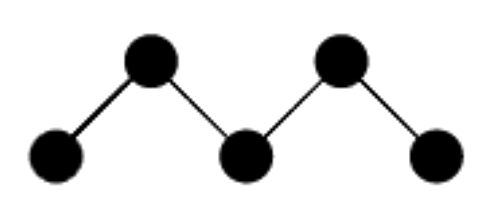
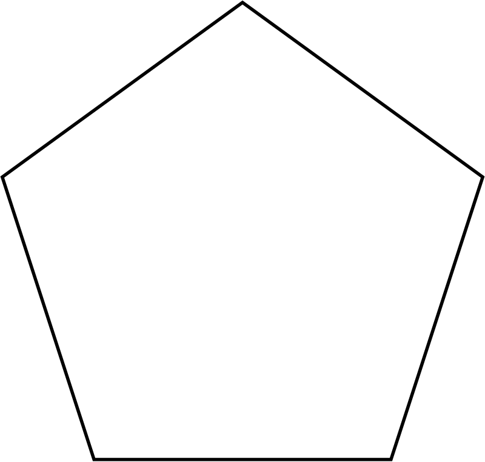
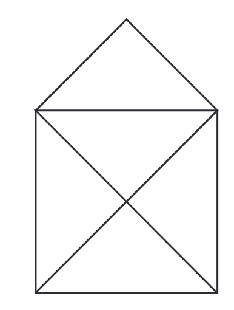

# Übungen mit der Turtle 

## 📝 Übung 2

Versuche die Turtle anzuleiten, ein gleichseitiges Dreieck mit der Seitenlänge 100 zu zeichnen. Findest du den richtigen Drehwinkel?

## 📝 Übung 3

Zeichne die Figur auf der rechten Seite.
Die Verbindungslinien haben eine Länge von 100.
Beachte, dass die Turtle zum schluss wieder in der Mitte
der Figur sitzt.

## 📝 Übung 4

Zeichne die Figur auf der rechten Seite.
Die ausgefüllten Kreise haben einen Durchmesser von 20,
die Verbindungslinien eine Länge von 50.

**Tipps:** 

+ Du wirst die Funktion `dot` benötigen.
+ Die Turtle ist am Ende nicht mehr sichtbar.

## 📝 Übung 5

Zeichne mit der Turtle ein regelmässiges Fünfeck (Pentagon) mit
einer Seitenlänge von 150 Pixeln.

**Tipp:**

+ Beim regelmäßigen **3**-Eck (Gleichseitig) war der Drehwinkel **120°**
+ Beim regelmäßigen **4**-Eck (Quadrat) ist der Drehwinkel **90°**
+ Beim regelmäßigen **5**-Eck (Pentagon) ist der Drehwinkel ...

## 📝 Übung 6

Zeichne mit der Turtle zwei Quadrate ineinander.

## 📝 Übung 7

Das "Haus vom Nikolaus" ist ein Zeichenspiel für Kinder.
Ziel ist es, das besagte Haus in einem Linienzug aus genau 8 Strecken zu zeichnen,
ohne dabei eine Strecke zweimal zu durchlaufen.
Zeichne das Haus vom Nikolaus mithilfe der Turtle. 

## 📝 Übung 8

Zeichne die Schneeflocke, wie rechts abgebildet.

