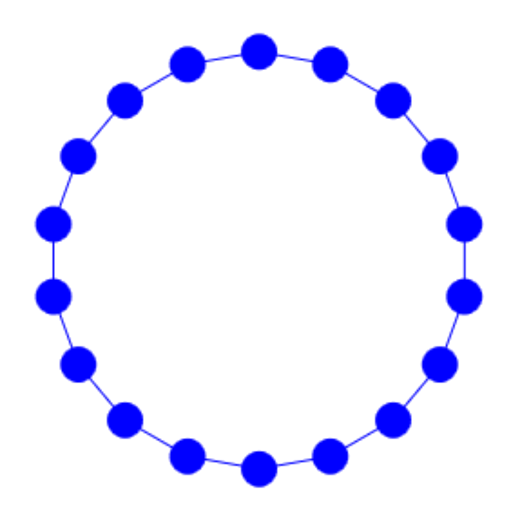
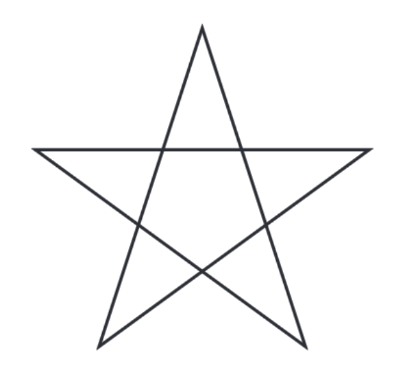

# Wiederholen von Codeblöcken

Häufig haben wir beim Programmieren die Situation,
dass wir einen gewissen Codeblock, also eine Folge von Anweisungen,
mehrfach ausführen möchten.

Das ist beispielsweise beim zeichnen eines Quadrats so:

```python
from gturtle import *
makeTurtle()

fd(50)
rt(90)
fd(50)
rt(90)
fd(50)
rt(90)
fd(50)
rt(90)
```

Die beiden Zeilen `fd(50)` und `rt(90)` werden hier viermal wiederholt.
Das ist umständlich und auch gar nicht nötig, denn wir können
Python anweisen, die zwei Zeilen einfach viermal auszuführen.

In diesem Kapitel lernst du Schleifen kennen, mit denen kannst du
Codeblöcke beliebig oft wiederholen lassen.

## Die for Schleife

Möchten wir einen Codeblock öfter ausführen so verwenden wir die 
for Schleife.
Möchten wir die beiden Zeilen aus dem vorhergegangen
Beispiel **vier**mal wiederholen, so schreiben wir:

```python
for i in range(4):
    fd(50)
    rt(90)
```

Damit Python weiß, welche Anweisungen den zu wiederholenden Codeblock bilden,
müssen diese gleich weit eingerückt sein.
Wir verwenden für Einrückungen grundsätzlich vier Leerschläge.

Die Variable `i` ist die Zählvariable, die mitzählt bei welcher Wiederholung wir sind.

**Vorsicht:** die Zählvariable beginnt bei `0` zu zählen,
wie überall in der Informatik üblich.
Deshalb zählt sie bei vier Wiederholungen von 0 bis 3.

## Beispiel
Um ein regelmäßiges Neuneck zu zeichnen muss
die Turtle neunmal geradeaus gehen und sich dann um 40° drehen.
Würdest du das alles untereinander schreiben, dann würde das Programm ziemlich lange werden.
Hier verwenden wir in Zeile 4 aber die
for-Schleife und sagen der Turtle damit, sie soll die zwei eingerückten
Funktionsaufrufe in Zeilen 5 und 6 neunmal wiederholen.

```python
from gturtle import *
makeTurtle()

for i in range(9):
    fd(50)
    rt(40)
```

## Übungen
### 📝 Übung 19

Zeichne die nebenstehende Figur. Dazu brauchst du auch die Funktionen bk() und dot().
<div style="clear:both;"></div>

### 📝 Übung 20

Zeichne eine Perlenkette, die aus 18 Perlen (dots) besteht. Zwischen den Perlen muss die Turtle jeweils einige Schritte vorwärts gehen und um einen kleinen Winkel (z.B. 20°) nach links drehen.
<div style="clear:both;"></div>

### 📝 Übung 21

Zeichne die Treppenfigur in der nebenstehenden Abbildung.
Verwende dazu die for-Schleife.
<div style="clear:both;"></div>

### 📝 Übung 22

Zeichne das Pentagramm in der nebenstehenden Abbildung.
Überlege dir zuerst, wie die Drehwinkel lauten
und verwende wieder die for-Schleife um die Figur zu zeichnen.
<div style="clear:both;"></div>

### 📝 Übung 23

Zeichne den Stern in der nebenstehenden Abbildung.
Überlege dir zuerst, welche Teile wiederholt werden 
und verwende wieder die for-Schleife um die Figur zu zeichnen.
<div style="clear:both;"></div>

### 📝 Übung 24
Schreibe ein Programm, bei dem der Benutzer eine Ganzzahl eingeben kann.
Gibt der Benutzer die Zahl 3 ein, so wird ein regelmäßiges Dreieck gezeichnet.
Gibt der Benutzer die Zahl 4 ein, so wird ein regelmäßiges Viereck gezeichnet,
und so weiter.

 	

## Zusammenfassung
Mit `for i in range(anzahl):` gibst du der Turtle
an, sie soll einen oder mehrere Anweisungen `anzahl`-mal wiederholen,
bevor sie mit neuen Anweisungen weitermacht.
Alles, was wiederholt werden soll, muss unter repeat stehen und eingerückt sein.

```python
for i in range(anzahl):
    Anweisungen die
    wiederholt
    werden sollen 
```

