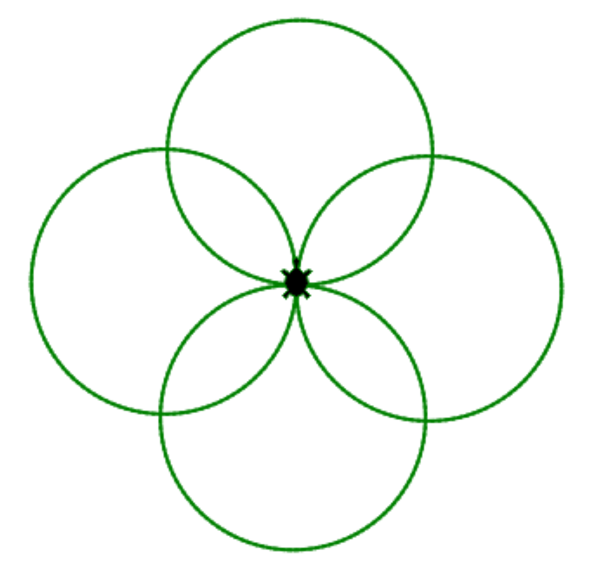
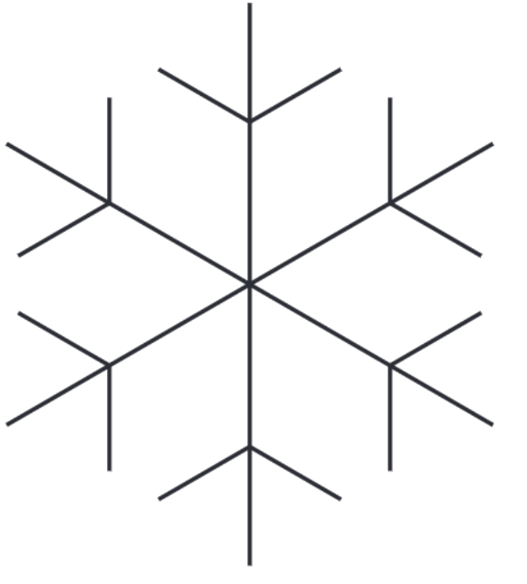

# Kapiteltest 1

## Aufgabe 1

Definiere eine Funktion, die einen Kreis zeichnet. Benutze
die Funktion, um die rechts dargestellte Figur zu zeichnen.

## Aufgabe 2

Schreibe eine Funktion, welche einen "Ast" der
nebenstehenden Schneeflocke zeichnet.
Schreibe eine weitere Funktion, welche die Funktion
"Ast" sechs mal aufruft, um die gesamte Schneeflocke
zu erhalten.

## Aufgabe 3

Schreibe eine Funktion `schachbrett`, welche ein Schachbrett zeichnet.
Die Funktion soll zwei Parameter mit den Namen `x` und `y` haben.
Diese beiden Parameter geben die Anzahl der Spalten und die Anzahl der Zeilen an.
Du kannst davon ausgehen, dass sowohl x, als auch y, gerade Zahlen sind.
Das heißt x und y sind ohne Rest durch 2 dividierbar.

**Tipp:** Schreibe eine Funktion welche ein Mini-Schachbrett mit
der Größe 2x2 zeichnet und und wiederhole dieses x/2 mal in x-Richtung
und y/2 mal in y-Richtung.

	

## Aufgabe 4	
Schreiben Sie ein Programm, bei dem der Benutzer die Länge,
Breite und Tiefe eines Swimmingpools in Metern
eingeben kann. Berechnen Sie wie viele Liter der Swimmingpool fasst.

## Aufgabe 5	
Schreibe ein Programm, bei dem der Benutzer:

+ die Distanz einer zu fahrenden Strecke und
+ die durchschnittliche Reisegeschwindigkeit eingeben kann

Berechne die resultierende Fahrtdauer

## Aufgabe 6	
Schreiben Sie ein Programm, bei dem der Benutzer sein Alter
in Jahren eingeben kann. Geben Sie das Alter in Sekunden aus.

## Aufgabe 7	
Schreiben Sie ein Programm, bei dem der Benutzer die Anzahl
der zu zeichnenden Quadrate eingeben kann.
Gibt der Benutzer beispielsweise 5 ein,
so werden fünf Quadrate nebeneinander gezeichnet

## Aufgabe 8
Schreiben Sie ein Programm, bei dem der Benutzer die Anzahl der
Ecken eines regelmäßigen Vielecks angibt. Gibt
der Benutzer beispielsweise 8 ein, so soll ein regelmäßiges Achteck gezeichnet werden.

## Aufgabe 9
Schreiben Sie ein Programm, bei dem der Benutzer die Anzahl der
Blütenblätter einer Blume eingeben kann. Falls
der Benutzer 20 eingibt, wird eine Blume mit 20 Blütenblättern gezeichnet.

## Aufgabe 10
Schreiben Sie ein Programm, bei dem der Benutzer die Anzahl
der Blütenblätter und die Anzahl der Blumen eingeben kann.
Falls er beispielsweise 20 und 6 eingibt, werden sechs Blumen mit zwanzig Blütenblättern
nebeneinander gezeichnet.

