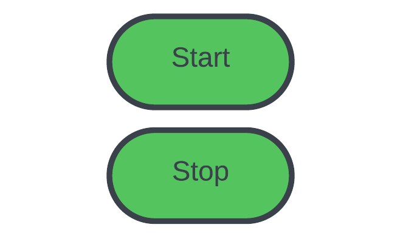
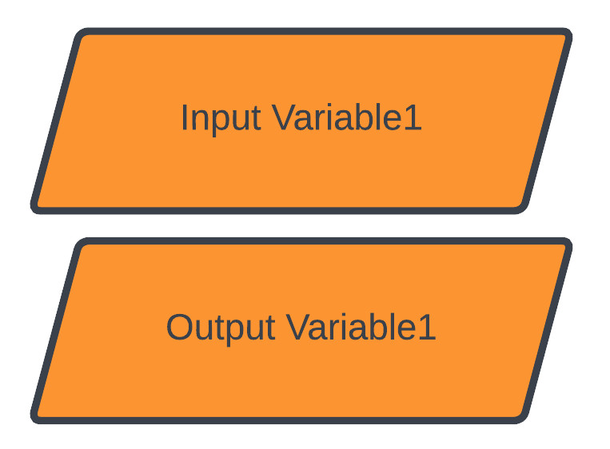
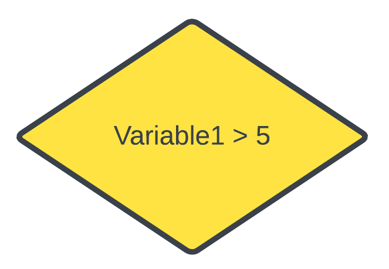
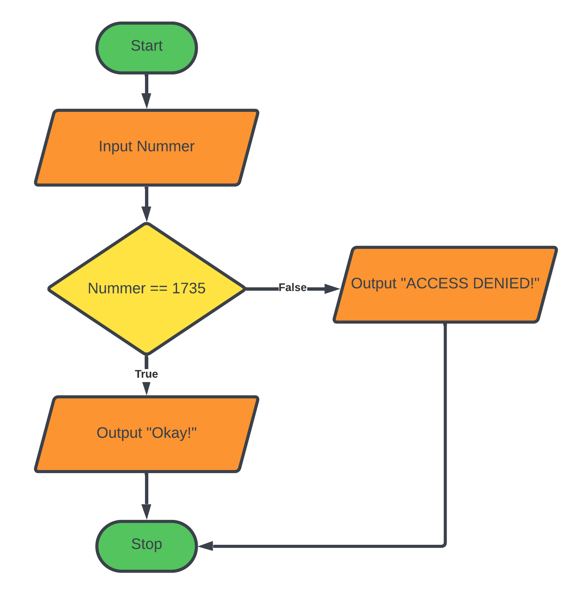
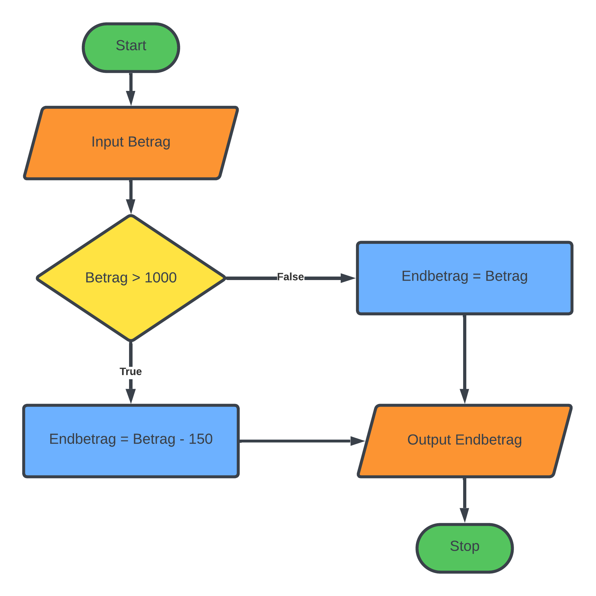

# Grafische Darstellung von Programmen

Programme werden durch den Programmcode vollständig definiert.
Es ist aber auch möglich Programme grafisch darzustellen.
In dieser Darstellung können Programme oft einfacher verstanden werden.
Des Weiteren ist es auch für "Nicht-Programmierer" möglich ein Programm zu verstehen.

## Flussdiagramme

Zur Darstellung von einfachen Programmen verwenden wir Flussdiagramme
(engl. Flowcharts).
In den folgenden Abbildungen siehst du die Symbole aus
denen Flussdiagramme bestehen und einige Beispiele für komplette Flussdiagramme.

### Start / Stop

Dieses Symbol zeigt den Start und das Ende des Programms.

### Operation (Tätigkeit)

Beschreibt eine Operation, wie eine Berechnung,
oder eine Wertzuweisung zu einer Variable.

### Eingabe / Ausgabe

Beschreibt das Einlesen von Werten vom Benutzer oder die 
Ausgabe von Werten. Dieses Symbol entspricht den Funktionen `input` bzw. `print`.

### Verzweigung

Dieses Symbol repräsentiert die `if`-Verzweigung.
Es enhält eine Bedingung und zwei Ausgänge.
Je nachdem, ob die Bedingung erfüllt ist, wird entweder
zum einen Ausgang oder zum anderen verzweigt.

### Pfeil

Der Pfeil verbindet die Symbole untereinander.

## Beispiele

### Passworteingabe

In diesem Beispiel soll der Benutzer eine Geheimnummer eingeben.
Die Geheimnummer ist 1735.

Falls die Eingabe richtig ist, soll das Programm: "Okay!" ausgeben.
Falls die Nummer falsch ist, soll das Programm: "ACCESS DENIED!" ausgeben.

### Rabatt ab 1000€

In diesem Beispiel soll ein Rabatt von 150€ gewährt werden,
falls der Einkaufswert mehr als 1000€ beträgt.

### Flächenberechnung Quadrat

In diesem Beispiel der Benutzer nach der Seitenlänge eines
Quadrats gefragt werden. Falls die Seite kleiner als `0` ist,
so soll eine Fehlermeldung ausgegeben werden.
Ist die Seite größer oder gleich `0`, soll die Fläche berechnet
werden und danach ausgegeben werden. 

