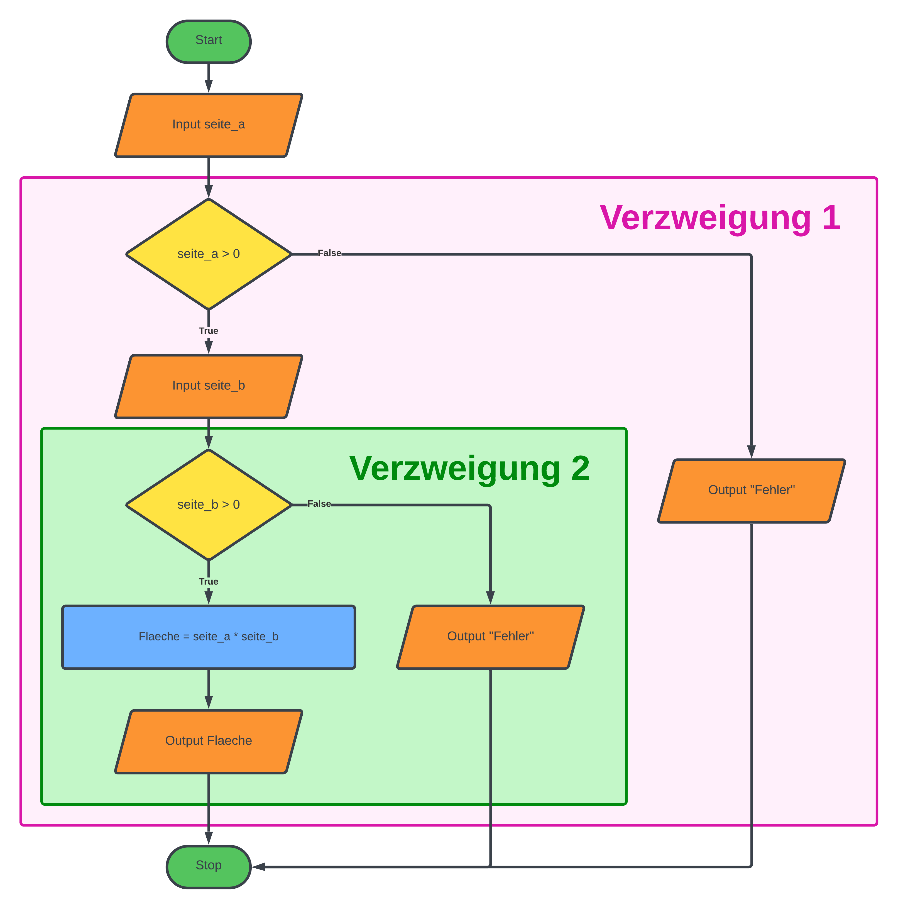

# Verschachtelung von Verzweigungen

In diesem Kapitel sehen wir uns an, wie wir eine weitere `if`-Verzweigung
in den `if`-Teil oder in den `else`-Teil einer `if`-Verzweigung packen können.
Wir nennen das eine **verschachtelte Verzweigung**.
Flussdiagramme, die wir im letzten Kapitel kennengelernt haben,
helfen uns jetzt Verschachtelungen schön darzustellen und
damit leichter zu verstehen.

## 💡 Beispiel als Flussdiagramm

Nehmen wir an wir möchten ein Programm schreiben,
bei dem der Benutzer die Seitenlängen eines Rechtecks eingeben kann,
und das Programm berechnet den Flächeninhalt und gibt ihn aus.

Wir möchten nach der Eingabe der Seite `a` prüfen, ob die Länge positiv ist.
Falls die Seite `a` positiv ist, fragen wir den Benutzer nach der Seite `b`.
Falls die Seite `a` nicht positiv ist, so beenden wir das Programm.

In der folgenden Abbildung siehst du ein Flussdiagramm des oben
beschriebenen Programms:



In der obigen Abbildung sehen wir, dass die erste Verzweigung zwei "Ausgänge" hat.
Der Pfeil nach rechts wird ausgeführt, wenn die Bedingung nicht zutrifft,
die Seite `a` also nicht positiv ist. Hier wird eine Fehlermeldung ausgegeben und
das Programm beendet.

Falls die Bedingung aber stimmt, die Seite `a` also positiv ist, so wird die Seite `b`
eingelesen und danach geprüft, ob die Seite `b` positiv ist.
Auch diese Verzweigung hat wieder zwei mögliche Ausgänge.
Entweder die Seite `b` ist positiv, dann wird die Fläche berechnet,
ansonsten wird wieder eine Fehlermeldung ausgegeben.

Was wir klar erkennen können, ist dass die zweite Verzweigung in der ersten enthalten ist.
Genauer gesagt ist die zweite Verzweigung im `if`-Teil der ersten Verzweigung.

Im folgenden Codebeispiel siehst du wie man Verzweigungen in Python verschachtelt.

## 💡 Codebeispiel

Im folgenden Codebeispiel siehst du,
wie du eine `if`-Verzweigung in einer anderen verschachtelst.
Wichtig ist, dass die "innere" Verzweigung eingrückt ist.

```python
def main():
    seite_a = float(input("Seite a eingeben: "))

    if (seite_a > 0):
        seite_b = float(input("Seite b eingeben: "))

        if (seite_b > 0):
            flaeche = seite_a * seite_b

            print("Die Fläche ist", flaeche)
        else:
            print("Fehler: Seite b ist nicht postiv")
    else:
        print("Fehler: Seite a ist nicht postiv")

main()
```
_________________

## Übungen

### 📝 Übung 48

Zeichne zuerst ein Flussdiagramm und schreibe ein Programm,
bei dem der Benutzer zuerst die aktuelle Temperatur
eingeben kann und danach seinen aktuellen Kontostand.

* Falls die Temperatur größer als 20 Grad ist **und** der Kontostand größer als 10€ ist,
so soll: "Ich gehe ein Eis essen" ausgegeben werden.
* Falls **nur** die Temperatur kleiner oder gleich 20 Grad ist, so soll:
"Kein Eis, es ist zu kalt." ausgegeben werden
* Falls **nur** der Kontostand kleiner oder gleich 10€ ist, so soll:
"Kein Eis, ich habe kein Geld" augegeben werden
* Falls die Temperatur kleiner oder gleich 20 Grad
**und** der Kontostand kleiner oder gleich 10€ ist,
so soll: "Es ist zu kalt für ein Eis und ich habe kein Geld" ausgegeben werden.

### 📝 Übung 49

Schreibe ein Programm bei dem der Benutzer zuerst drei Zahlen `a`, `b` und `c` eingeben kann.
Das Programm soll die größte der drei zahlen ausgeben.

Zeichne wieder zuerst ein Flussdiagramm und schreibe dann ein Programm.

### 📝 Übung 50

Schreibe ein Programm bei dem der Benutzer eine Zahl eingeben kann.

* Falls die Zahl positiv ist, soll "Zahl ist positiv" ausgegeben werden
* Falls die Zahl negativ ist, soll "Zahl ist negativ" ausgegeben werden
* Falls die Zahl gleich `0` ist, soll "Zahl ist 0" ausgegeben werden

Verwende zwei verschachtelte Verzweigungen.

**Tipp:** Die erste Schleifenbedingung muss `> 0` sein,
die zweite Schleifenbedingung muss `< 0` sein.


## 🧭 Zusammenfassung


