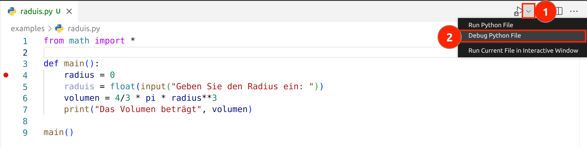
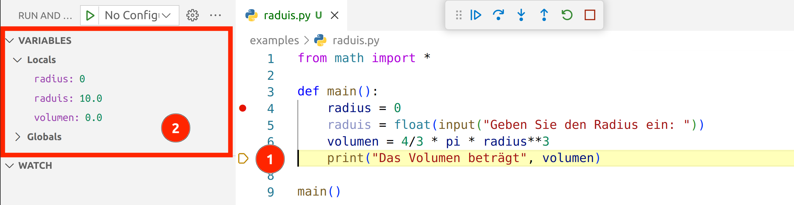

# Fehler in Programmen finden

In diesem Kapitel wollen wir uns einige Techniken ansehen,
mit denen wir Fehler in Programmen finden können.

Einen Fehler nennen wir beim Programmieren auch **Bug**, englisch für Käfer.
Dieser Begriff hat sich in der Informatik durchgesetzt, da es bei den ersten Computern,
welche raumgroße Maschinen waren, manchmal Insekten gab, welche sich in den Relais
verfingen und dadurch Fehlfunktionen verursachten.

Das Beheben eines Fehlers, nennt man auch **Debugging**, also zu deutsch etwa *entkäfern*. 😉

## Debugging mit der print-Funktion

Nehmen wir an wir haben folgendes Programm geschrieben,
welches das Volumen eines **Quaders** berechnen soll.
Wir wollen die Formel für gerade Prismen benutzen: *Volumen = Grundfläche x Höhe*.
In das Programm habe ich absichtlich einen Fehler eingebaut.
Ich habe nämlich in die Formel der Grundfläche ein `+` statt einem `*` eingebaut.

```python
def main():
    a = float(input("Geben Sie die Seitenlänge a ein: "))
    b = float(input("Geben Sie die Seitenlänge b ein: "))
    hoehe = float(input("Geben Sie die Höhe ein: "))
    flaeche = a + b
    volumen = flaeche * hoehe
    print("Das Volumen beträgt", volumen)

main()
```

Wenn wir das Programm starten, merken wir, dass das Ergebnis nicht stimmt.
Eine Möglichkeit dem Problem auf die Schliche zu kommen,
ist Zwischenergebnisse mit `print` auszugeben.

Im folgenden Programm werden alle Variablen mit `print` ausgegeben:
```python
def main():
    a = float(input("Geben Sie die Seitenlänge a ein: "))
    b = float(input("Geben Sie die Seitenlänge b ein: "))
    hoehe = float(input("Geben Sie die Höhe ein: "))
    print(a,b,hoehe)
    flaeche = a + b
    print(flaeche)
    volumen = flaeche * hoehe
    print("Das Volumen beträgt", volumen)

main()
```

Das Programm gibt jetzt auch die Zwischenwerte aus und
es fällt uns nun sicher leichter den Fehler zu entdecken und
das Programm in die endgültig richtige Version zu verwandeln:

```python
def main():
    a = float(input("Geben Sie die Seitenlänge a ein: "))
    b = float(input("Geben Sie die Seitenlänge b ein: "))
    hoehe = float(input("Geben Sie die Höhe ein: "))
    flaeche = a * b
    volumen = flaeche * hoehe
    print("Das Volumen beträgt", volumen)

main()
```

## Schritt-für-Schritt Ausführung von Programmen

Nehmen wir wieder an, wir haben ein fehlerhaftes Programm.
Wir wollten eigentlich ein Programm schreiben,
welches das Volumen einer Kugel berechnet.
Jedoch wird immer `0` ausgegeben, obwohl wir die richtige Formel haben.
Findest du den Fehler?

```python
from math import *

def main():
    radius = 0
    raduis = float(input("Geben Sie den Radius ein: "))
    volumen = 4/3 * pi * radius**3
    print("Das Volumen beträgt", volumen)

main()
```

Wie du vielleicht gesehen hast, habe wurde einmal rad**iu**s und einmal rad**ui**s geschrieben.
Wir können den Fehler aber auch finden, indem wir das Programm Schritt-für-Schritt ausführen.
Das Vorgehen dafür ist in den folgenden Abschnitten beschrieben.

### Setzen des Haltepunkts

Wähle eine Zeile in der du ungefähr den Fehler vermutest.
Ab dieser Zeile werden wir das Programm Schritt-für-Schritt ausführen.
Klicke, wie in folgender Abbildung sichtbar, mit der Maus auf den 
linken Bereich neben der Codezeile.
Es sollte ein roter Punkt entstehen.
Der Punkt, auch **Haltepunkt** genannt, sagt aus, dass das Programm
an dieser Stelle unterbrochen wird.


### Aktivieren des Debug Modus

Klicke zuerst mit der Maus auf das kleine Dreieck neben dem Play-Button (1).
Wähle aus dem Drop-Down die Option "Debug Python File" (2).



### Schrittweises Ausführen des Programmcodes

Beim Klick auf "Debug Python File" wird das Programm gestartet 
und solange ausgeführt, bis ein Haltepunkt getroffen wird.
Dann erscheint unten dargestellte Grafik.
Die Codezeile, welche als nächstes ausgeführt werden soll,
ist gelb hinterlegt.

Es erscheinen zusätzlich folgende Optionen:

1. Programm normal weiter ausführen
1. **Einen Schritt ausführen**
1. In eine Funktion reinspringen
1. Aus einer Funktion rausspringen
1. Programm neu starten
1. Programm beenden

Wir klicken drei Mal auf den zweiten Button
um die nächsten drei Zeilen Code auszuführen.


### Auslesen von aktuellen Variablenwerten

Wir sehen, dass die nächste Zeile (1) nun die Zeile Nummer 7 ist.
Die Zeilen 4, 5 und 6 wurden also bereits ausgeführt.
Auf der linken Seite (2) sehen wir eine Liste aller zurzeit verfügbaren Variablen
und deren Wert.

Wenn wir scharf drauf schauen, dann erkennen wir, dass bei **radius** und **raduis** etwas 
nicht stimmen kann.



## 🧭 Zusammenfassung


