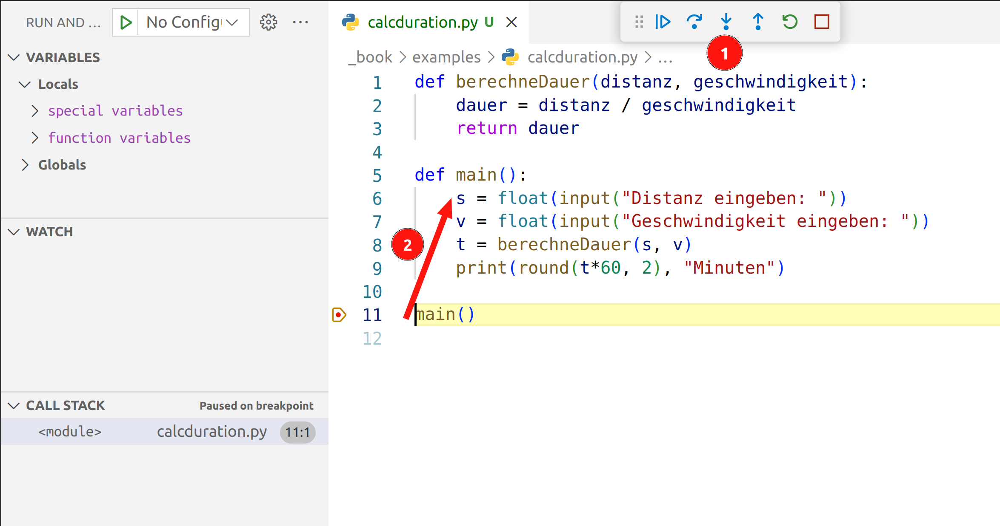
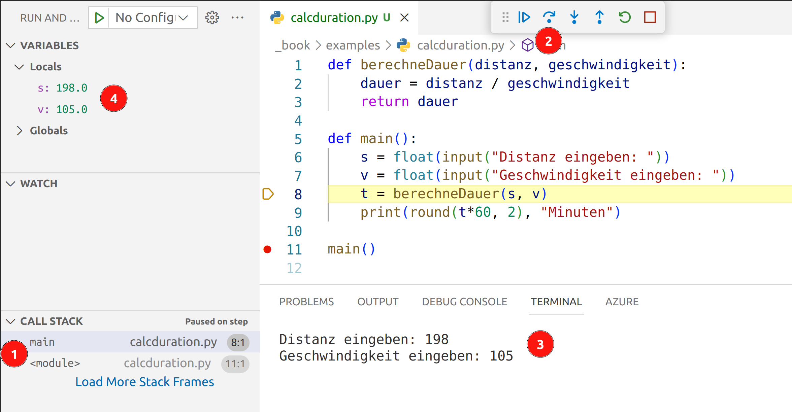
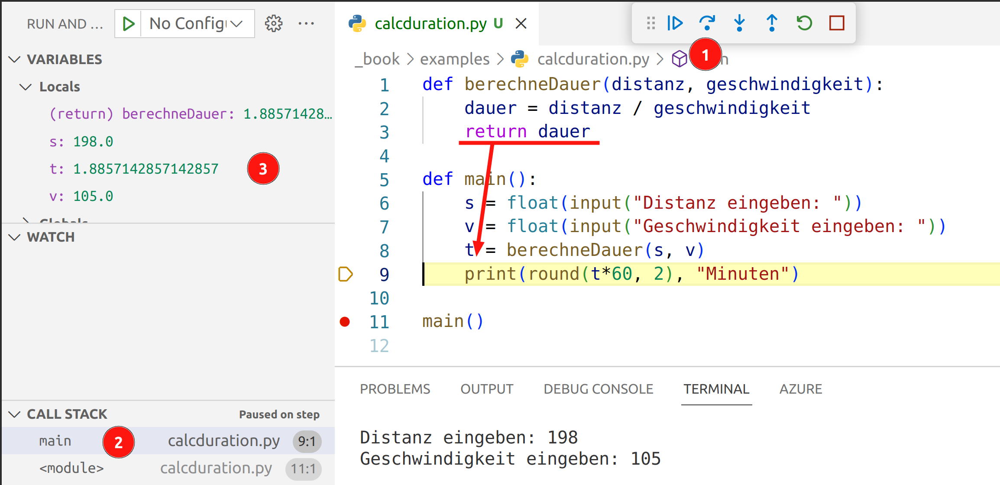

# Der Funktionsaufruf unter der Lupe

Zum Abschluss des Kapitels möchten wir den Aufruf von Funktionen
nochmals ganz genau Schritt-für-Schritt unter die Lupe nehmen.

Nehmen wir an, wir möchten ein Programm schreiben,
welches die Fahrtdauer für eine gewisse Strecke berechnet,
wobei Distanz und Geschwindigkeit bekannt sind.
Aus der Physik wissen wir, dass wir die
Fahrtdauer mit *t = s / v* berechnen können.
Folgendes Programm berechnet die Fahrtdauer in einer eigenen Funktion.

```python
def berechneDauer(distanz, geschwindigkeit):
    dauer = distanz / geschwindigkeit
    return dauer

def main():
    s = float(input("Distanz eingeben: "))
    v = float(input("Geschwindigkeit eingeben: "))
    t = berechneDauer(s, v)
    print(round(t*60, 2), "Minuten")

main()
```

## Starten des Programms

Das Programm wurde in VS Code kopiert und beim Aufruf der `main`-Funktion
wurde ein Haltepunkt gesetzt.
Würden wir jetzt einen Schritt weiter springen,
so würden wir das Programm bereits beenden, da wir mit diesem
Button nicht in die Funktion reinspringen.
Deshalb wählen wir den Button "In Funktion springen" (1).
Damit springen (2) wir vom Funktionsaufruf (Zeile 11) in die erste Zeile der Funktion (Zeile 6).



## In der Funktion main

In der folgenden Grafik sieht man links unten (1),
dass wir nun in der main-Funktion gelandet sind.
Die Liste links unten, ist ein Stapel, der die Funktionsaufrufe anzeigt.
Wenn wir jetzt zwei Mal auf "Einen Schritt ausführen" (2) klicken 
und entsprechende Werte eingeben (3),
so sehen wir, dass die Variablen `s` und `v` existieren und 
den von uns eingegeben Wert haben.



## Sprung in berechneDauer-Funktion

Die nächste Zeile, die ausgeführt werden soll, ist der Funktionsaufruf
für berechneDauer. Hier klicken wir wieder auf "In Funktion springen" (1),
damit wir von der main Funktion in die berechneDauer-Funktion springen.

Beachte, dass wir nun auf dem Stapel zwei Funktionen haben.
Unten im Stapel ist die main-Funktion und oben auf dem Stapel ist die
berechneDauer-Funktion.

Des Weiteren haben sich die lokalen Variablen geändert.
Wir haben zwei Parameter `distanz` und `geschwindigkeit` definiert und 
als Argumente die Werte von `s` und `v` übergeben. Deshalb haben die Variablen
`distanz` und `geschwindigkeit` genau die gleichen Werte wie `s` und `v` aus der main-Funktion.

Die Variablen `s` und `v` sind aber nicht mehr sichtbar, da sie aus einer anderen Funktion
stammen. Jede Funktion kann nur die Variablen sehen,
die in der Funktion selbst definiert sind,
oder die als Parameter übergeben wurden.

ℹ️ Streng genommen gibt es noch globale Variablen, diese können von überall aus zugegriffen werden. Das würde aber hier den Rahmen sprengen.


## Rücksprung in die main-Funktion
Mit einem Klick auf "Einen Schritt ausführen" (1) springen
wir mit dem `return`-Schlüsselwort zurück in die main-Funktion.
Der Wert hinter dem `return` ist der Rückgabewert.
Dieser wird in der main-Funktion der Variable `t` zugewiesen.

Im Stapel (2) sehen wir, dass das oberste Element,
das war die berechneDauer-Funktion entfernt wurde,
und wir wieder in der main-Funktion sind.

Auch die lokalen Variablen haben sich gändert.
Wir haben nun wieder die Variablen `s` und `v` zur Verfügung.
Der Funktionsaufruf von berechneDauer ist ohnehin schon vorbei,
das heisst die Variablen `distanz`, `geschwindigkeit` und `dauer` existieren nicht mehr.
Jedoch hätten wir zu keinem Zeitpunkt eine Möglichkeit gehabt von
der main-Funktion auf die Variablen der berechneDauer-Funktion zuzugreifen.

Am Ende wird noch die Zeit in Minuten ausgegeben.



## 🧭 Zusammenfassung


