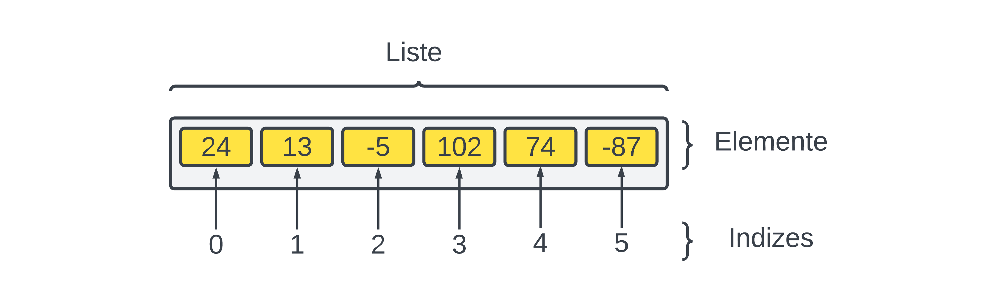

# Erstellen und Auslesen von Listen

In Python erstellst du Listen, indem du die Elemente
der Liste mit Komma getrennt in eckige Klammern schreibst.

Die folgende Codezeile erstellt eine Liste mit 6 Elementen
und gibt diese Liste aus.

```python
meineListe = [24, 13, -5, 102, 74, -87]
print(meineListe)
```

Es ist auch möglich eine leere Liste zu erstellen, indem
man die Elemente weglässt:

```python
leereListe = []
```
## Zugriff auf Elemente mit Indizes

Der oben abgebildete Code erzeugt die unten abgebildete Liste.
Man sieht, dass jedes Element einen eindeutigen **Index** hat.
Der Index beginnt bei `0` beim ersten Element
und wird bis zum letzten Element hochgezählt.
Über diesen Index kann auf das Element zugegriffen werden.



Im folgenden Programm wird das Element mit dem Index 2 ausgegeben.

```python
meineListe = [24, 13, -5, 102, 74, -87]
print(meineListe[2])
```

### Verändern von Elementen

Es ist auch möglich die Elemente einer Liste zu verändern.
Um das Element mit dem Index `4` auf die Zahl `1000` zu ändern,
können wir folgendes schreiben.

```python
meineListe = [24, 13, -5, 102, 74, -87]
meineListe[4] = 1000
print(meineListe)
```

Das Programm gibt `[24, 13, -5, 102, 1000, -87]` aus.
Die Zahl, die vorher am Index 4 war (74),
wurde durch 1000 **ersetzt**.

**⚠️ Vorsicht:** Der Index beginnt bei `0`.
Wenn die Liste `n` Elemente hat, geht der Index also von `0` bis `n-1`.
Wenn du also beispielsweise das 4. Element
der Liste ändern willst, so musst du den Index 3 angeben.
Das Element mit dem Index 4 ist **nicht** das 4. Element,
sondern das 5. 

## Übungen

### 📝 Übung 63

In der folgenden Abbildung siehst du eine Liste.

Beantworte folgende Fragen:

* Wie viele Elemente hat die Liste?
* Wie lautet der Index des letzten Elements?
* Wie lautet der Index des Elements `-43`?
* Wie lautet der Index des ersten Elements?


### 📝 Übung 64
Schreibe ein Python Programm, welches die oben 
abgebildete Liste erstellt.

## 🧭 Zusammenfassung


