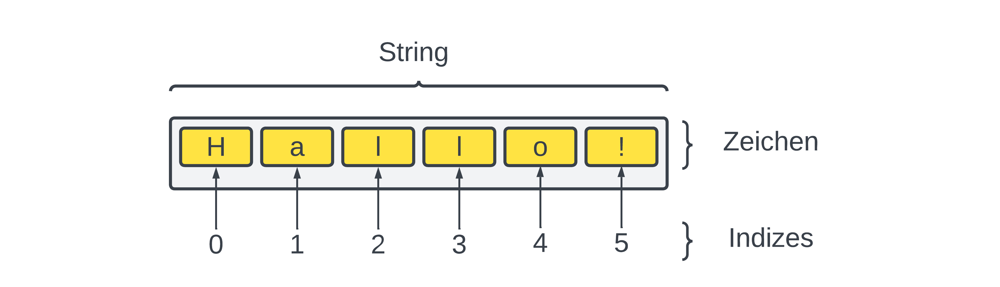

# Strings

Texte heißen beim Programmieren «Strings» oder «Zeichenketten». In
diesem Kapitel geht es um einfache Textverarbeitung. Du lernst zum
Beispiel, Texte zusammenzufügen, Texte umzudrehen oder zu Prüfen
ob Texte Zahlen beinhalten.

Ein wichtiges Ziel ist aber auch die Kryptographie – die Ver- und Entschlüsselung von Texten.
So kannst du einen Text relativ einfach verschlüsseln, wenn du alle Buchstaben veränderst.
Das Zählen von Buchstaben hingegen hilft dir, einen verschlüsselten Text zu knacken.

Strings sind den bereits bekannten Listen nicht unähnlich.
Einen String können wir uns quasi als Liste von Buchstaben vorstellen:

Genau wie bei Listen wird auf die einzelnen Elemente mit einem Index zugegriffen.
Die Elemente bei einem String nennen wir jedoch Zeichen.
Als Zeichen sind alle gültigen Unicode-Zeichen zulässig,
also beispielsweise Buchstaben, Ziffern, Sonderzeichen, chinesische Zeichen,
arabische Zeichen und sogar Emojies.

Wir sehen uns in den folgenden Abschnitten an, wie wir mit Strings in Python arbeiten können.

