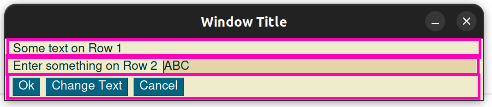

# Ein minimales GUI Programm

In diesem Abschnitt entwickeln wir ein erstes GUI Programm.
Zuerst müssen wir das PySimpleGUI Modul installieren
und anschließend den Code für das Minimalprogramm starten.

Während das Minimalprogramm für die Turtle nur zwei Zeilen hatte,
ist es hier schon etwas mehr.


## Installation des PySimpleGUI Moduls

Python Module werden über sogenannte Pakete verteilt,
wobei ein Paket mehrere Module enthalten kann.
Häufig werden die Begriffe Module und Pakete jedoch synonym verwendet.

Um ein Python Paket zu installieren benutzen wir den  Python Paketmanager.
Dieser wird standardmässig mit Python mitgeliefert
und verfügt über Funktionen zum installieren, deinstallieren oder auflisten
von Python Paketen.

In VS Code kannst du im Terminalbereich folgenden Befehl eingeben:

```
pip3 install pysimplegui
```

In der folgenden Abbildung siehst du wie das Paket installiert wird.
Wir klicken zuerst auf Terminal (1) und geben dann den Befehl (2) ein.
Falls kein Terminal geöffnet ist, können wir mit `Terminal > New Terminal` (3)
ein neues Terminal öffnen.


## Das Minimalprogramm

Das Minimalprogramm von PySimpleGUI ist auf dem ersten Blick, sehr Umfangreich.
Wir werden es aber Schritt für Schritt aufbauen.

## Das Modul importieren und Theme setzen
Beginnen wir mit dem Import des Moduls.
Bis jetzt haben wir stets die Syntax `from abc import *` benutzt.
Das würde prinzipiell auch hier funktionieren, dann hätten wir 
aber auf einen Schlag hunderte Funktionen importiert.
Sauberer ist es das Modul mit einem Alias zu laden:

```python
import PySimpleGUI as sg
```

Nehmen wir an, es gäbe die Funktion `abc` in PySimpleGUI.
Dann könnten wir nach dieser Zeile mit `py.abc` auf diese Funktion zugreifen.

Die erste Aufgabe die wir haben, ist das *Theme* zu setzen.
Das Theme legt fest, welche Farben in unserer GUI verwendet werden.
Unter der URL https://t.ly/qp3l findest du sämtliche Möglichkeiten.

Ich entscheide mich für das Theme `"SandyBeach"`.
Die Funktion um das Theme zu setzen heisst `theme`
und muss nun über den alias `sg` aufgerufen werden,
Wobei Modulalias und Funktion durch einen Punkt getrennt werden.
Wir schreiben also:

```python
import PySimpleGUI as sg
sg.theme("SandyBeach")
```

Teste dieses Programm. Es gibt noch nichts aus,
aber es sollte auch noch keine Fehlermeldung erscheinen.

13:30

## Elemente erstellen und das Layout festlegen

Unser GUI-Programm besteht am Ende aus GUI-Elementen.
Diese sind uns aus vielen Softwareprodukten bekannt, wie beispielsweise
Buttons oder Eingabetextfelder.
Das Layout definiert welche GUI-Elemente an welcher Position angezeigt werden.
Wir beginnen mit den drei häufigsten Elementen: dem Button, dem Textlabel
und dem Eingabetextfeld.

In der folgenden Abbildungen werden diese GUI-Elemente dargestellt.


### Button (1)
Ein Button ist ein GUI-Element, welches Benutzern 
die Interaktion mit einem Programm ermöglicht, indem sie darauf klicken,
um Funktionen auszulösen.
In der obigen Grafik sind alle Elemente in der untersten Reihe Buttons.

Ein Button wird mit `sg.Button("Hallo")` angelegt.
Das Argument `"Hallo"` wird auf dem Button angezeigt.

### Textlabel (2)
Das Textlabel ist ein nicht-interaktives GUI-Element, das dazu dient,
Informationen oder Beschriftungen anzuzeigen.
Es ist nicht-interaktiv, da bei einem "Klick" auf das Element üblicherweise
nichts passiert. Auch kann ein Benutzer dort nichts eingeben.

Ein Button wird mit `sg.Text("Ich bin ein Text")` angelegt.
Wobei das Argument `"Ich bin ein Text"` angezeigt wird.

### Eingabetextfeld (3)
Ein Eingabetextfeld ist eine interaktive Benutzeroberflächenkomponente,
die es Benutzern ermöglicht, Text einzugeben.
Es wird verwendet, um Benutzereingaben zu sammeln,
wie z.B. in Formularen oder Suchfeldern.

Ein Button wird mit sg.InputText("ABC", key="eingabe1") angelegt.
Wobei das Argument `"ABC"`  im Texteingabefeld angezeigt wird.
Das zweite Argument `key="eingabe1"`, wird benötigt um später auf
das Texteingabefeld zuzugreifen und die Benutzereingabe auszulesen. 

### Definieren des Layouts
Das Layout legt fest wie die GUI-Elemente im Fenster angeordnet werden.
Mit PySimpleGUI definieren wir die Elemente zeilenweise.
In unserem Beispiel haben wir drei Zeilen.



Jede Zeile wird als eine Liste von Elementen definiert.
Alle Zeilen zusammen kommen wieder in eine Liste.
Das folgende Beispiel zeigt bereits unsere GUI.

```python
import PySimpleGUI as sg
sg.theme("SandyBeach")

# Hier das Layout definieren:
# Das Layout ist eine Liste von Listen
# Jede Zeile wird durch eine Liste definiert
layout = [  
            [sg.Text("Some text on Row 1")],
            [sg.Text("Enter something on Row 2"), sg.InputText("ABC", key="eingabe1")],
            [sg.Button("Ok"), sg.Button("Change Text"), sg.Button("Cancel")]
         ]

# Window erstellen
window = sg.Window("Window Title", layout)

while True:
    event, values = window.read()
```

Dieses Programm solltest du bereits starten können
und das gewünschte GUI sollte erscheinen.
Jedoch stürzt das Programm noch ab,
wenn es geschlossen wird, das ändern wir im nächsten Abschnitt.

## Die Event-Loop

Eine Event-Loop (engl. Ereignisschleife) ist ein häufig 
wiederkehrendes Muster in der Softwareentwicklung,
die in vielen Anwendungen verwendet wird. Sie überwacht kontinuierlich
ob Ereignisse wie Mausklicks oder Tastatureingaben.

Wenn solch ein Ereignis auftritt, ruft die Event-Loop die entsprechende Funktion auf,
um darauf zu reagieren.
Nach der Verarbeitung kehrt die Event-Loop zur Überwachung neuer Ereignisse zurück.

Im folgenden Programmstück siehst du die Event-Loop.
Es handelt sich um eine Endlosschleife,
denn die Schleifenbedingung ist immer wahr,
da hier fix der Wert `True` steht.

In der ersten Zeile der Schleife wird die Funktion `read`
aufgerufen. Diese Funktion gibt einen Wert zurück,
wenn ein Ereignis (engl. event) eintritt,
also beispielsweise auf einen Button geklickt wird.

Die `read`-Funktion gibt zwei Werte zurück,
den Namen des GUI-Elements, welches den event bewirkt hat,
in der variable `event` und eine assoziative Liste aller
aktuellen Werte der GUI-Elemente in der Variable `values`.

```python
# Event Loop:
# Jede Benutzereingabe kann mit window.read() abgefragt werden
# Diese Schleife läuft so lange, das Programm läuft (Endlosschleife)
while True:
    event, values = window.read()
    
    #hier die events (Benutzereingabe unterscheiden)
    if event == sg.WIN_CLOSED or event == "Cancel": 
        break

    if event == "Ok":
        print("You entered ", values["eingabe1"])

    if event == "Change Text":
        window["eingabe1"].update("Hallo Welt")

#Fenster Schließen
window.close()
```

## Auf events reagieren

Wie wir in der obigen event Loop sehen haben wir
drei `if`-Verzweigungen in der Event-Loop.

Jedes `if` prüft, ob ein gewisser event eingetreten ist,
und führt dann eine Aktion durch.

Die drei wichtigsten Aktionen sind:

* Das Programm beenden: Mit dem Schlüsselwort `break`, wird die event-Loop gestoppt und danach `window.close()` ausgeführt, was das Programm beendet

* Einen Wert auslesen und weiterverarbeiten: Mit `values["eingabe1"]` können wir auf den aktuellen Wert des GUI-Elements `eingabe1` zugreifen

* Einen Wert setzen: Mit `window["eingabe1"].update("Hallo Welt")` setzen wir einen neuen Wert (`"Hallo Welt"`) in das GUI-Element mit den Namen `"eingabe1"`.

## Zusammenfassung

Das gesamte Minimalprogramm findest du nochmals hier.

```python
import PySimpleGUI as sg
sg.theme("SandyBeach")

layout = [  
            [sg.Text("Some text on Row 1")],
            [sg.Text("Enter something on Row 2"), sg.InputText("ABC", key="eingabe1")],
            [sg.Button("Ok"), sg.Button("Change Text"), sg.Button("Cancel")]
         ]

window = sg.Window("Window Title", layout)

while True:
    event, values = window.read()
    
    if event == sg.WIN_CLOSED or event == "Cancel": 
        break

    if event == "Ok":
        print("You entered ", values["eingabe1"])

    if event == "Change Text":
        window["eingabe1"].update("Hallo Welt")

window.close()
```